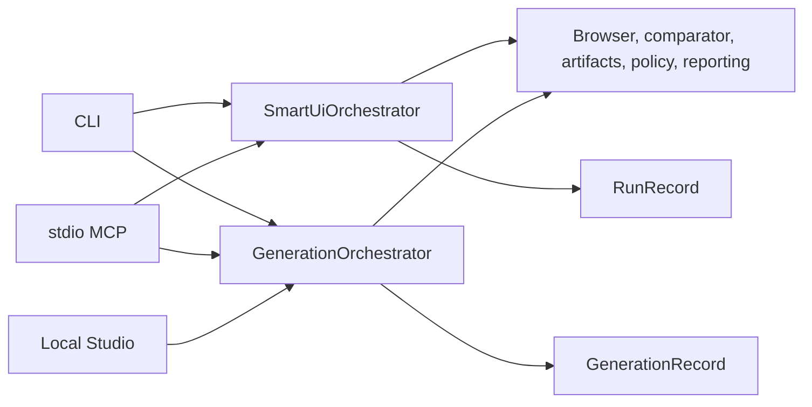

# Architecture

Smart UI Validator has one host-neutral core and two product workflows. Adapters translate host
inputs and outputs; they do not own comparison, scoring, policy, or orchestration.

| Workflow                           | Orchestrator             | Inputs                                                                    | Records and output                                      |
| ---------------------------------- | ------------------------ | ------------------------------------------------------------------------- | ------------------------------------------------------- |
| Existing UI validation and repair  | `SmartUiOrchestrator`    | Repository, `DesignContract`, running route, configuration                | `RunRecord`, evidence, report, optional bounded repairs |
| Repository-free SVG/PNG generation | `GenerationOrchestrator` | Contained SVG/PNG, optional typed/source context, mode/layout preferences | `GenerationRecord`, HTML/CSS, evidence, report, ZIP     |

The two workflows share browser, comparison, artifact, policy, reporting, and provenance
foundations but do not overload each other's contracts or permissions.

## Existing UI validation and repair

`SmartUiOrchestrator` coordinates narrow interfaces:

- `DesignProvider` normalizes evidence into a `DesignContract`.
- `FrameworkAdapter` inspects a repository without mutation. `AutoFrameworkAdapter` selects the
  production React or Angular adapter from package evidence; both discover components, tokens,
  routes, states, tests, Storybook, and native conventions within strict file/byte budgets.
- `RepairProvider` receives compact deterministic findings and proposes bounded file changes.
- `CodingProvider` remains as a Phase 1-compatible host boundary; current orchestration does not
  depend on a particular model.
- `BrowserProvider` captures deterministic implementation evidence.
- `SmartUiComparator` owns geometry, typography, appearance, asset, raster, runtime, and basic
  accessibility scoring.
- `ArtifactStore` persists content-addressed bytes and a manifest.
- `PolicyProvider` enforces paths, writes, commands, endpoints, dry-run, pass, and time limits.
- `Reporter` turns a `RunRecord` into a human-readable offline artifact.

Data flows from untrusted design and repository inputs through strict schemas and policy boundaries
into an isolated browser and content-addressed evidence store. Repair proposals are checked against
exact writable files, command argument arrays, and endpoint allowlists. Each accepted patch is
re-rendered; non-improving, repeated, or test-regressing patches are reverted without overwriting
pre-existing content. Run records contain artifact references rather than binary prompt data.

Browser state setup occurs after deterministic page settling and before DOM/screenshot capture.
Hover/focus/active use an explicit selector; loading/empty/error/disabled are route-owned rendered
states. Elements marked dynamic must match configured selectors; their measured rectangles join the
deterministic raster mask list. Accessibility violations and contrast remain code-calculated.

## Repository-free SVG/PNG generation

`GenerationOrchestrator` is additive to `SmartUiOrchestrator`; it does not fabricate a repository or
overload `DesignContract`, `RunRecord`, or repository repair permissions. `SvgStructureProvider`
accepts one contained regular SVG, rejects unsafe XML, and emits a hierarchical `DesignBundle` 2.0
plus a content-addressed sanitized source. A verified PNG is retained unchanged and represented by
a bounded internal SVG image wrapper so the same render/comparison pipeline remains authoritative.
The bundle carries bounded typed design evidence and a
`PresentationSpec` that separates source dimensions from the exact target canvas. An
`HtmlGenerationProvider` creates a bounded exact file
manifest. The core serves only that manifest on an ephemeral loopback origin, captures it with the
existing isolated browser, and measures it with the existing comparator.

Exact mode prioritizes source-viewport fidelity and preserves more SVG-native representation.
Hybrid mode projects stable readable/semantic nodes while retaining complex visual subtrees.
Semantic mode creates the strongest bounded HTML projection. Narrow captures without a matching
reference are classified as responsive robustness and have no source-fidelity score.
Source, fallback, authored output, preview, diff, and overlay share the same primary-canvas fit,
alignment, and DPR rules. `GenerationRecord` 2.0, report, and ZIP remain separate from repository
validation records; supported 1.0 bundles, records, and authoring requests have explicit
compatibility readers.

The CLI accepts `--design-context` as bounded UTF-8 source evidence and `--structured-context` as
typed `StructuredDesignContext` JSON. Credential-like source text is redacted before it enters the
artifact store; the record retains its original hash and redaction status. Deterministic mode does
not interpret arbitrary JSX as if a model had authored from it. `--engine agent` creates one bounded
request in the same workspace-contained queue as Studio, exposes it through the existing MCP tools,
waits under an explicit timeout/cancellation boundary, and supplies the response to
`HostProposedHtmlGenerationProvider` with the fallback and deterministic comparison intact.
Temporary queue evidence is removed after success, timeout, or cancellation.

The stdio MCP adapter exposes only inspection, complete generation, retrieval, reporting, and
separately approved export. Normalized scene nodes are paged in groups of 50; raw XML, full generated
files, and binary evidence remain artifacts. `HostProposedHtmlGenerationProvider` converts one
approved UTF-8 HTML/CSS/SVG file batch into the same provider-neutral contract. The orchestrator
measures both the deterministic fallback and proposal, rejects repeated output or structural/visual
regression, and records both immutable passes with proposal provenance. No model SDK enters the
core, and a host never scores its own proposal.

## Studio host

`apps/studio` is a private React/Vite build input, not a fourth published package or a separate
engine. Its reviewed production server and hashed static assets are copied into
`smart-ui-validator/dist/studio` after the Studio build; the CLI dynamically loads only that packaged
subtree.

`smart-ui studio` is a thin local host over the public generation APIs. Upload inspection uses a
dedicated per-run inspection store, generation starts with a new empty immutable artifact root, and
the persisted `GenerationRecord` remains authoritative. Browser state is only a projection of that
record. Completed records are recovered after restart, and accepted manifests can be previewed again
on separate ephemeral origins.

Before generation, Studio may store one bounded UTF-8 design-context file inside the opaque run.
The versioned authoring bridge sends its redacted content, original hash, filename, media type, byte
size, and provenance to the connected agent alongside sanitized SVG or verified PNG evidence. The
context is never executed; binary or oversized input is rejected.

The Studio server binds only `127.0.0.1`, uses opaque run identifiers, and never accepts an arbitrary
server path from page JavaScript. One process capability is held in an HTTP-only SameSite cookie; a
separate CSRF value plus exact Host/Origin checks protects API writes. Generated code is returned as
JSON text and rendered through React escaping, never injected into the Studio document. Preview HTML
is served by `LoopbackGeneratedPreviewProvider`, preserving one engine and one output policy across
CLI, MCP, and Studio.

Studio does not participate in repository inspection or repair. It is a visual interface for the SVG/PNG
generation branch only and collects no Figma/model credentials or telemetry.

## Governed interaction, memory, and deployment boundaries

- `InteractionProvider` asks bounded host-neutral questions; terminal and non-interactive hosts own
  presentation and timeout behavior.
- `MemoryProvider` owns scoped lifecycle operations. `LocalMemoryProvider` is deterministic storage;
  `AgentMemoryProvider` uses the linked fork's public `VectorStore` for SQLite persistence and
  rehydrates governed records without importing fork internals.
- `AuthorizationProvider`, `EncryptionProvider`, `MetricsProvider`, `FileAuditLog`,
  `LocalBackupManager`, and `RetentionManager` define deployment control boundaries without coupling
  orchestration to one identity, KMS, telemetry, or storage vendor.
- `LocalBaselineStore` keeps explicit, attributed visual-regression approvals.
- `smart-ui-validator-mcp` is a thin stdio adapter. Codex, Claude Code, Copilot, and optional
  OpenClaw/Slack use the same core and schemas.

Memory recall occurs after repository inspection and before design comparison. It is optional,
identity-bound, scope-filtered, budgeted, marked as untrusted/advisory, and recorded as a compact
decision containing identifiers and context measurements. It never reaches `PolicyProvider` and
cannot expand paths, commands, endpoints, or approvals. Repository memory is not implicitly reused as
SVG generation authority.

The publishable workspace contains `core`, `cli`, and `mcp-server`; Studio is bundled inside the CLI.
React and Angular apps are controlled fixtures. Remote HTTP and channel networking are not core
responsibilities and stay disabled until a deployment control plane authenticates and authorizes an
explicit isolation context.
