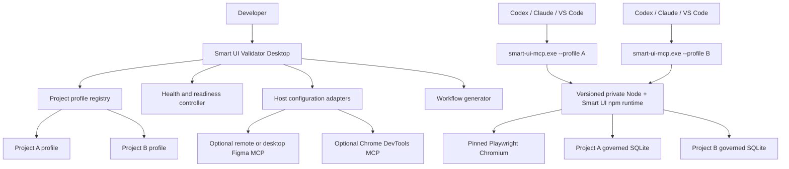

# Smart UI Validator EXE

## Product, architecture, and implementation plan

Status: Planned; implementation starts only after the npm handoff gate passes

Target repository: a new, separately maintained public repository named
`smart-ui-validator-exe`

Source dependencies: versioned public npm releases from `dev-agent-memory` and
`smart-ui-validator`

Primary first platform: Windows 11 and supported Windows 10 x64

Primary deliverable: a signed `SmartUIValidator-Setup-X.Y.Z-x64.exe` with a graphical project and
integration manager

## 1. Objective

Smart UI Validator EXE turns the existing host-neutral engine into a Windows product that can be
installed and configured without asking an end user to clone repositories, install Node or pnpm,
build TypeScript, locate an MCP entry point, install Playwright manually, or edit host configuration
by hand.

The application manages one installed runtime and any number of isolated project profiles. For each
profile it can inspect a React or Angular repository, configure an MCP-capable host, provision the
matching Chromium build, verify governed SQLite memory, connect optional Figma and Chrome DevTools
MCP integrations, generate the target-contained workflow, perform real health checks, and provide
copyable starter prompts.

The EXE is a distribution and configuration product. It does not fork Smart UI's orchestration,
scoring, repair, policy, memory governance, or MCP schemas.

## 2. Dependency gate before repository creation

Do not begin the desktop implementation until all of the following pass:

- Agent Memory is public on npm at an immutable reviewed version.
- `smart-ui-validator-core`, `smart-ui-validator`, and `smart-ui-validator-mcp` are public on npm at
  one compatible version.
- A clean Windows machine can install the npm packages without Git or private credentials.
- Agent Memory opens and persists a disposable SQLite record on Windows.
- The Smart UI CLI starts and reports its version.
- The Smart UI MCP package completes initialize and tool-list over stdio.
- The pinned Playwright Chromium revision launches and exits cleanly.
- Package integrity, repository links, licenses, and provenance are verified.

Production EXE builds consume exact npm versions. They must not clone either source repository,
resolve a branch, or install `latest`.

## 3. Product principles

1. **One engine, many projects.** Install the runtime once; create an isolated profile for each
   target repository.
2. **Thin desktop adapter.** Reuse public Smart UI APIs and commands. Do not duplicate validators,
   schemas, scoring, or repair logic in the UI.
3. **Private runtime.** Bundle or provision a product-owned Node runtime. Never depend on or mutate
   the user's global Node, npm, pnpm, or PATH by default.
4. **On-demand stdio.** Smart UI MCP runs as a child process started by the selected AI host. It is
   not a permanent Windows service.
5. **Project containment.** Every MCP process receives one exact project root. Adding projects never
   widens another profile's boundary.
6. **Evidence-backed health.** “Ready” means a real canary or protocol handshake, not merely a file,
   registry entry, or open port.
7. **Explicit changes.** Show configuration diffs and request confirmation before writing host or
   project files.
8. **Host-owned OAuth.** Figma and other MCP OAuth credentials remain with the host or operating
   system credential facility. The desktop app does not collect passwords or copy tokens into
   project files.
9. **Reproducible distribution.** Node, engine, browser, launcher, UI, and schemas are connected by a
   signed version manifest and verified checksums.
10. **Recoverable upgrades.** Install versioned runtimes side by side, verify the new runtime, switch
    profiles atomically, and retain a bounded rollback version.

## 4. Non-goals for the first release

- Hosting an AI model or replacing Codex, Claude Code, or GitHub Copilot.
- Shipping remote Smart UI MCP over HTTP.
- Running Smart UI MCP as a machine-wide Windows service.
- Installing SQL Server, PostgreSQL, or another database service. Agent Memory uses embedded SQLite.
- Connecting to the user's everyday Chrome profile.
- Editing arbitrary host configuration without a preview and confirmation.
- Automatically starting unknown target commands inferred from repository text.
- Supporting multi-user or multi-tenant server deployment from the desktop app.
- macOS and Linux desktop releases before the Windows contracts are stable.

## 5. Repository ownership and boundaries

Create a separate repository:

```text
smart-ui-validator-exe/
├── apps/
│   └── desktop/
│       ├── src/                    # React/Vite user interface
│       ├── src-tauri/              # Rust/Tauri shell and Windows integration
│       ├── public/
│       └── tests/
├── crates/
│   ├── smart-ui-launcher/          # console launcher shared behavior
│   └── smart-ui-mcp-launcher/      # stdout-clean stdio launcher
├── packages/
│   ├── project-registry/           # schemas and migrations
│   ├── runtime-manifest/           # build/runtime compatibility schemas
│   ├── runtime-assembler/          # npm, Node, browser assembly
│   ├── host-configurators/         # Codex, Claude, VS Code adapters
│   ├── health-checks/              # deterministic global/profile probes
│   ├── workflow-generator/         # calls/reuses Smart UI setup contracts
│   └── support-bundle/             # redacted diagnostic export
├── scripts/
│   ├── assemble-runtime.ts
│   ├── verify-runtime.ts
│   ├── generate-checksums.ts
│   └── verify-installer.ts
├── docs/
│   ├── architecture.md
│   ├── security.md
│   ├── operations.md
│   ├── release.md
│   └── support.md
├── evaluations/
├── package.json
├── pnpm-lock.yaml
└── AGENTS.md
```

The repositories divide responsibility as follows:

| Repository             | Owns                                                                                   | Must not own                                                         |
| ---------------------- | -------------------------------------------------------------------------------------- | -------------------------------------------------------------------- |
| Agent Memory           | Public memory/store APIs and SQLite behavior                                           | Desktop profiles or host configuration                               |
| Smart UI Validator     | Core orchestration, CLI, MCP schemas, browser validation, policy, reports              | Windows installer UI or machine-wide installation                    |
| Smart UI Validator EXE | Runtime assembly, project registry, host configuration, Windows UI, installer, updates | A second validator, repair loop, or memory-governance implementation |

## 6. System architecture



The GUI may launch short-lived diagnostic processes. Normal MCP sessions are owned by the AI host.

## 7. Installed layout

Use a per-user install by default:

```text
%LOCALAPPDATA%\Programs\SmartUIValidator\
├── Smart UI Validator.exe
├── bin\
│   ├── smart-ui.exe
│   └── smart-ui-mcp.exe
├── runtimes\
│   ├── 0.1.0\
│   │   ├── node\node.exe
│   │   ├── smart-ui\
│   │   ├── browsers\
│   │   ├── templates\
│   │   ├── THIRD_PARTY_NOTICES.txt
│   │   └── runtime-manifest.json
│   └── previous\
├── current-runtime.json
└── uninstall.exe
```

Application state belongs under:

```text
%LOCALAPPDATA%\SmartUIValidator\
├── projects.json
├── settings.json
├── logs\
├── downloads\
├── support\
└── update-state.json
```

Project-specific state remains inside each target:

```text
<project>\.smart-ui\
├── workflow.json
├── AGENT_WORKFLOW.md
├── design\
├── artifacts\
├── memory.json
├── agent-memory.sqlite
└── generated host configuration preview files
```

Do not place one project's artifacts or memory in another project's profile or in a shared prompt
cache.

## 8. Project profile contract

Use a versioned, strict schema similar to:

```json
{
  "schemaVersion": "1.0",
  "id": "c2c9848d-8ad9-4d4c-8b30-1eb17367f32b",
  "name": "Customer Portal",
  "root": "C:\\Projects\\customer-portal",
  "realRoot": "C:\\Projects\\customer-portal",
  "framework": "react",
  "runtimeVersion": "0.1.0",
  "smartUiVersion": "0.5.0",
  "host": {
    "kind": "codex",
    "scope": "project",
    "configurationPath": "C:\\Projects\\customer-portal\\.codex\\config.toml"
  },
  "target": {
    "url": "http://127.0.0.1:5173/",
    "startCommand": {
      "executable": "npm.cmd",
      "args": ["run", "dev"]
    },
    "automaticStart": false
  },
  "figma": {
    "mode": "remote",
    "enabled": true,
    "credentialOwner": "host"
  },
  "chromeDevtools": {
    "enabled": false
  },
  "memory": {
    "enabled": true,
    "backend": "agent-memory"
  },
  "createdAt": "2026-08-09T00:00:00.000Z",
  "updatedAt": "2026-08-09T00:00:00.000Z"
}
```

Requirements:

- Generate opaque IDs; never use a raw path as a storage namespace.
- Canonicalize the root and reject unsafe broad targets such as a drive root or user home.
- Reject symlink or junction escapes.
- Preserve unknown future versions by failing closed and offering an explicit migration.
- Store no OAuth token or plaintext secret in the profile.
- Require confirmation before changing the target root, host scope, executable, arguments, endpoint,
  or automatic-start setting.

## 9. Runtime manifest contract

Every assembled runtime contains a signed or hash-covered manifest:

```json
{
  "schemaVersion": "1.0",
  "desktopVersion": "0.1.0",
  "runtimeVersion": "0.1.0",
  "architecture": "x86_64-pc-windows-msvc",
  "nodeVersion": "22.23.0",
  "smartUi": {
    "core": "0.5.0",
    "cli": "0.5.0",
    "mcpServer": "0.5.0",
    "mcpProtocol": "1.0",
    "configSchema": "1.0"
  },
  "agentMemory": {
    "package": "dev-agent-memory",
    "version": "0.4.0",
    "integrity": "sha512-EFdjhoX1uxoAmfarGxtkuML20n+GuEE4udRdpdcUmSYmUAHUDkQ4LVU9jnH3YpTAZpvvHGK9TYXaJb6kxlL0Gw=="
  },
  "playwright": {
    "version": "1.55.1",
    "browser": "chromium",
    "revision": "reviewed-revision"
  },
  "files": [
    {
      "path": "node/node.exe",
      "sha256": "...",
      "size": 0
    }
  ]
}
```

The assembler fails when package versions diverge, the Playwright browser is incompatible, a hash
changes, a required public export is absent, or an unexpected executable enters the payload.

## 10. EXE and launcher model

The downloadable artifact is one installer:

```text
SmartUIValidator-Setup-0.1.0-x64.exe
```

The installed product contains three executables:

| Executable               | Subsystem   | Responsibility                                                    |
| ------------------------ | ----------- | ----------------------------------------------------------------- |
| `Smart UI Validator.exe` | Windows GUI | Profiles, setup, status, logs, updates, prompts                   |
| `smart-ui.exe`           | Console     | Launch the packaged CLI using the selected runtime/profile        |
| `smart-ui-mcp.exe`       | Console     | Launch the packaged stdio MCP server without contaminating stdout |

The launchers are small Rust binaries. They locate the selected runtime, validate its manifest,
resolve the profile, set controlled environment variables, and spawn the private Node process using
explicit argument arrays.

`smart-ui-mcp.exe` requirements:

- Pass stdin and stdout through byte-for-byte.
- Write diagnostics only to stderr and redacted log files.
- Set `SMART_UI_MCP_ROOT` to the exact canonical project root.
- Set `PLAYWRIGHT_BROWSERS_PATH` to the versioned product browser directory.
- Reject missing, migrated, disabled, or integrity-failed profiles before starting Node.
- Forward termination and cancellation signals.
- Return the child exit code.
- Never invoke a shell or concatenate command strings.

## 11. Runtime assembly

The EXE repository build uses its own temporary build-time Node and pnpm, but assembles a separate
runtime for users:

1. Install the frozen desktop lockfile.
2. Resolve exact Smart UI and Agent Memory npm versions.
3. Verify npm integrity and repository metadata.
4. Copy only production dependencies into a staging directory.
5. Download the approved Node Windows distribution and verify its official checksum.
6. Install the exact Playwright Chromium revision into a hermetic staging path.
7. Compile x64 console launchers.
8. Generate third-party license notices and an SBOM.
9. Generate the runtime manifest and file hashes.
10. Run the runtime from the staging directory as a clean consumer.
11. Mark the staging tree read-only for the packaging step.
12. Ask Tauri/NSIS to embed it as installer resources.

No build step may reach a Git dependency, private registry, unpinned URL, or `latest` tag.
The assembler and desktop health controller should consume Smart UI's public structured `runSetup`
and `runDoctor` contracts where applicable. The desktop may replace the download transport and
paths with its checksum-verified private runtime implementation, but it must not create a divergent
definition of Chromium or Agent Memory readiness.

## 12. Desktop technology

Use Tauri 2 with React, TypeScript, and Vite:

- React owns presentation and local view state.
- Rust owns filesystem access, process spawning, registry/shortcut integration, atomic updates, and
  security-sensitive validation.
- Tauri capabilities allow only named commands and exact sidecars.
- The application uses the system WebView2 runtime by default, with an embedded bootstrapper for
  systems where it is absent.
- NSIS produces the setup `.exe`; MSI can be added later for managed enterprise deployment.

Do not expose a general-purpose shell command from Rust to the webview. Every operation must have a
typed request and a narrow implementation.

## 13. Primary UI

### 13.1 First run

```text
Welcome
  -> Verify installed runtime
  -> Add project
  -> Inspect framework and configuration
  -> Choose AI host
  -> Preview and apply MCP configuration
  -> Configure optional Figma
  -> Configure optional Chrome DevTools MCP
  -> Run full verification
  -> Generate workflow and starter prompt
```

### 13.2 Projects dashboard

Each card displays:

- Project name and canonical path.
- React or Angular framework/build system.
- Configured host and scope.
- Target URL reachability.
- Smart UI MCP configured/verified/active state.
- Chromium, memory, Figma, and optional DevTools state.
- Last health check and last successful validation.

Actions:

- Open project.
- Check status.
- Configure.
- Generate workflow.
- Copy prompt.
- View reports.
- Export support bundle.
- Remove profile without deleting project data, or separately delete managed Smart UI data after an
  exact destructive preview.

### 13.3 Project tabs

```text
Overview
Target application
AI host
Figma
Browser
Validation policy
Memory
Workflow and prompts
Diagnostics
Logs
```

### 13.4 Change preview

Before configuration writes, show:

- File path.
- Whether the file is new or existing.
- Structured before/after diff.
- Exact MCP command, arguments, cwd, timeouts, and approval mode.
- Backup/restore behavior.
- Restart required state.

Never replace an entire existing Codex, Claude, VS Code, or `AGENTS.md` file when a structural merge
is possible. Refuse ambiguous formats instead of guessing.

## 14. Host configuration adapters

Define one interface:

```ts
interface HostConfigurator {
  detect(): Promise<HostDetection>;
  inspect(profile: ProjectProfile): Promise<HostConfigurationState>;
  plan(profile: ProjectProfile): Promise<ConfigurationChangePlan>;
  apply(plan: ApprovedConfigurationChangePlan): Promise<ConfigurationResult>;
  verify(profile: ProjectProfile): Promise<HostVerification>;
  rollback(result: ConfigurationResult): Promise<RollbackResult>;
}
```

### Codex

- Prefer project-scoped `.codex/config.toml` for trusted projects.
- Point `command` to `smart-ui-mcp.exe` and pass the profile ID.
- Set the exact target `cwd`.
- Preserve write-prompt approval for repair and governed memory mutation.
- Verify configuration structurally, then run a direct MCP handshake. The UI may also instruct the
  user to restart Codex and confirm through `/mcp`.

### Claude Code

- Use a project-scoped `.mcp.json` unless the user deliberately selects another supported scope.
- Preserve unrelated servers and settings.
- Keep credentials out of the file.
- Verify through a direct handshake and provide the host-specific restart/list instructions.

### VS Code / GitHub Copilot

- Use workspace `.vscode/mcp.json`.
- Preserve unrelated servers and inputs.
- Enable host sandbox settings when supported.
- Keep filesystem writes limited to the workspace and browser networking limited to approved local
  targets by default.

Host detection is advisory. Do not install or upgrade an AI host without a separate future feature
and explicit user approval.

## 15. Figma integration

Offer:

1. **Remote Figma MCP — recommended.** Configure the host for `https://mcp.figma.com/mcp` and let the
   host perform OAuth.
2. **Figma desktop MCP.** Probe `http://127.0.0.1:3845/mcp` only after the user enables it in Figma
   Dev Mode.
3. **No Figma.** Continue supporting local reference images.

Figma status levels:

```text
not configured
configured, authentication required
configured, unreachable
connected, initialize passed
connected, expected tools discovered
```

The UI never asks for a Figma password or stores a bearer token in its registry. A remote OAuth
status may require a host restart or user action; display this as a required action, not an automatic
failure.

## 16. Chromium and Chrome DevTools MCP

Treat these separately:

### Required Playwright Chromium

- Version matched to Smart UI's Playwright dependency.
- Stored under the versioned runtime.
- Launched with a disposable profile for a readiness canary.
- Used by the deterministic validator.
- Never points at the user's everyday Chrome data.

### Optional Chrome DevTools MCP

- Installed/configured only after explicit selection.
- Version pinned in the runtime manifest.
- Started on demand or configured in the selected host.
- Verified by MCP initialize and expected tool discovery.
- Uses an isolated browser/profile unless the user explicitly approves another reviewed setup.

An open TCP port alone is not a successful health check.

## 17. SQLite and governed memory

SQLite is embedded storage, not a Windows service. Display:

```text
Governed memory
  backend: Agent Memory SQLite
  path: <project>\.smart-ui\agent-memory.sqlite
  open: passed
  persistence canary: passed
  degraded mode: false
```

The canary must use an isolated disposable identity and record, then confirm deletion. It must not
read or mutate user memories. Memory remains project/identity scoped and advisory; desktop status
cannot promote, confirm, or forget memories without the same explicit approvals as other hosts.

## 18. Health model

Use structured results:

```ts
type HealthStatus = 'pass' | 'action-required' | 'warn' | 'fail' | 'not-configured';

interface HealthCheckResult {
  id: string;
  scope: 'installation' | 'project' | 'host' | 'integration';
  status: HealthStatus;
  summary: string;
  evidence: Record<string, unknown>;
  remediation?: RemediationAction;
  checkedAt: string;
}
```

Required checks:

| Scope        | Check             | Passing evidence                                     |
| ------------ | ----------------- | ---------------------------------------------------- |
| Installation | Runtime manifest  | Schema, signature/hash, architecture and files valid |
| Installation | Private Node      | Exact expected version exits successfully            |
| Installation | Smart UI packages | Exact versions and required exports present          |
| Installation | Chromium          | Isolated launch, page creation, close                |
| Project      | Root containment  | Canonical directory, no broad root, no escape        |
| Project      | Framework         | Smart UI inspection returns React or Angular         |
| Project      | Config            | Strict Smart UI configuration loads                  |
| Project      | Target URL        | Allowed URL responds with recorded status            |
| Project      | Memory            | Disposable open/persist/reopen/delete passes         |
| Host         | Config            | Expected structured server entry exists              |
| Host         | Smart UI MCP      | Initialize and expected tools/resources/prompts pass |
| Integration  | Figma             | Host auth/initialize/tool discovery state known      |
| Integration  | DevTools          | Process/HTTP initialize and tool discovery pass      |

Never expose secrets, full environment dumps, source files, DOM, screenshots, or raw memory in the
health response.

## 19. Workflow and prompt generation

The GUI collects:

- Target project.
- Local design image or Figma mode/link.
- Target URL.
- Optional component name and selector.
- Host.
- Memory preference.

It then calls or reuses Smart UI's versioned setup contract to create:

```text
.smart-ui/workflow.json
.smart-ui/AGENT_WORKFLOW.md
.smart-ui/design/*
.smart-ui/artifacts/
host configuration preview
```

The final screen includes a copyable prompt:

> Read `.smart-ui/AGENT_WORKFLOW.md` and use the Smart UI MCP tools. Call `prepare_workflow` once,
> reuse its returned arguments, inspect and plan before editing, validate before repair, request
> approval for exact writable files, repair only in bounded passes, and return the report and run
> record paths.

Generate host-specific wording only where the host requires it. The core workflow and safety rules
remain shared.

## 20. Dependency installation experience

The UI owns all product dependencies:

```text
Private Node runtime       bundled or verified download
Smart UI packages          bundled from exact npm versions
Agent Memory               bundled transitively from exact npm version
Playwright Chromium        bundled offline or downloaded with checksum
WebView2                   detected; embedded bootstrapper when absent
Smart UI launchers         bundled native binaries
```

It does not globally install Node, pnpm, npm packages, SQLite, Chromium, or PATH entries by default.

The npm CLI's supported `smart-ui setup` flow is the pre-desktop reference behavior: pinned browser
installation, real browser launch, optional embedded-SQLite persistence, structured results, and
exit code `4` on failed readiness. The EXE presents equivalent evidence through the GUI while using
its product-owned runtime and verified download cache.

Target-project dependencies remain the target project's responsibility. If Smart UI discovers a
missing project dependency or command, it may explain the issue, but installing or changing target
dependencies requires an exact preview and explicit approval in a later feature.

## 21. Installer variants

### Offline installer — initial recommended release

- Includes Node, engine, Agent Memory, Chromium, launchers, UI, WebView2 bootstrapper, notices, and
  SBOM.
- Larger download.
- Predictable behind firewalls.
- No dependency network access during installation.

### Web installer — later

- Includes GUI/bootstrapper and signed manifest.
- Downloads versioned components into a staging directory.
- Verifies checksum/signature before activation.
- Supports proxy and internal artifact-mirror settings.
- Never executes partially downloaded content.

The first release should prioritize the offline installer because it offers the most deterministic
support boundary.

## 22. Installer behavior

Default NSIS installation:

- Per-user, no elevation.
- Start menu entry and uninstaller.
- No automatic startup.
- No Windows service.
- No global PATH modification.
- Preserve project registry and user data on normal application upgrade.
- Uninstall offers separate, explicit choices for application files, cached runtimes, logs, and
  project-managed `.smart-ui` data.
- Never delete project data merely because the desktop application is removed.

Enterprise MSI and machine-wide deployment are separate later milestones with administrative policy
and signing requirements.

## 23. Updates and rollback

Use versioned runtime directories:

1. Download update and manifest into staging.
2. Verify signature, hashes, architecture, compatibility, and disk space.
3. Install side by side.
4. Run global runtime canaries.
5. Run read-only canaries against opted-in project profiles.
6. Atomically update `current-runtime.json`.
7. Retain one previous verified runtime.
8. Roll back the pointer if startup or canaries fail.

Never migrate project configuration or memory destructively without backup, schema validation,
preview, and explicit migration logic. Do not run updates while an MCP session is using the runtime;
activate on the next session instead.

## 24. Security boundaries

- Treat project files, designs, DOM, browser responses, MCP content, memory, prompts, and logs as
  untrusted input.
- Use Rust commands with strict schemas; expose no arbitrary shell bridge.
- Validate canonical paths, Windows junctions, reparse points, and UNC paths.
- Use explicit executable and argument arrays.
- Allow only reviewed local endpoints by default.
- Store secrets in host-managed OAuth or Windows Credential Manager when desktop ownership is
  unavoidable.
- Use Windows ACLs to restrict application state.
- Redact usernames, paths, tokens, headers, source snippets, DOM, and memory from support bundles.
- Keep MCP stdout protocol-only.
- Code-sign installer and installed executables.
- Verify downloaded update signatures before extraction.
- Generate SBOM and third-party notices for every release.
- Retain audit records for configuration changes, profile changes, updates, and destructive actions.

Threat-model at least:

- Malicious project names and paths.
- Junction/symlink escape.
- Host-config injection.
- MCP stdout contamination.
- OAuth token disclosure.
- DLL search-order hijacking.
- Runtime manifest or update tampering.
- Cross-project memory/artifact leakage.
- Untrusted installer/update network.
- Stale browser/runtime mismatches.
- Prompt instructions attempting to broaden policy.

## 25. Logging and support bundles

Use structured local logs with rotation and size limits. Each record contains timestamp, component,
profile ID, operation, status, error code, and redacted summary. Do not log protocol payloads by
default.

The support bundle preview lists every included file and field. Default contents:

- Desktop/runtime versions.
- Operating system and architecture.
- Redacted health results.
- Runtime manifest and hashes.
- Redacted configuration shapes.
- Recent application error codes.
- MCP tool names and protocol versions, not arguments or results.

Exclude source, designs, screenshots, DOM, tokens, memory values, user environment dumps, and full
absolute paths unless a separate explicit support flow requests narrowly scoped evidence.

## 26. CI and release pipeline

Use a public GitHub repository with required checks. Build release artifacts on a GitHub-hosted
Windows runner:

```text
checkout exact tag
  -> install frozen desktop toolchain
  -> verify npm integrity/provenance
  -> assemble private runtime
  -> build Rust launchers
  -> run clean runtime smoke tests
  -> build React UI
  -> compile Tauri application
  -> create NSIS setup EXE
  -> install silently in Windows VM/runner
  -> run first-launch and multi-project tests
  -> uninstall and verify preservation rules
  -> generate SBOM/checksums
  -> code-sign
  -> verify signatures
  -> attach reviewed artifacts to GitHub release
```

Release builds require:

- Frozen lockfile.
- Exact engine and memory versions.
- No dirty generated source.
- No private dependency or registry.
- Release environment approval.
- Protected code-signing credentials or managed signing service.
- Artifact retention and hashes.

Do not sign an artifact that differs from the tested artifact.

## 27. Testing strategy

### Unit tests

- Profile schema, migration, normalization, and rejection.
- Windows path containment and reparse-point cases.
- Runtime manifest and compatibility evaluation.
- Host structural merge and rollback.
- Redaction and support-bundle selection.
- Health-state transitions.
- Command/argument construction without shell parsing.

### Integration tests

- Packaged Node starts the exact Smart UI CLI.
- MCP launcher completes initialize/list tools/resources/prompts.
- CLI launcher resolves profiles and exit codes.
- Chromium uses the product-owned browser location.
- SQLite canary persists and cleans up.
- Existing Codex/Claude/VS Code files retain unrelated settings.
- Figma remote reports authentication required without capturing credentials.
- Figma desktop and DevTools distinguish port reachability from MCP readiness.

### Desktop UI tests

- First-run setup.
- Add, edit, disable, remove, and restore multiple profiles.
- Preview, approve, apply, and roll back host configuration.
- Offline, failed download, corrupt manifest, insufficient disk, and antivirus-lock states.
- Accessible keyboard navigation, names, roles, focus, contrast, scaling, and screen reader basics.

### Installer tests

- Clean Windows 11 x64 install.
- Supported Windows 10 x64 install.
- Install without administrator privileges.
- Paths containing spaces and non-ASCII characters.
- Upgrade with active and inactive project profiles.
- Rollback after failed runtime canary.
- Silent install/uninstall behavior.
- Uninstall preserves project `.smart-ui` data unless explicitly selected.
- Signature and checksum verification.

### Multi-project isolation tests

- Project A process cannot read Project B workflow, artifacts, or memory.
- Host A configuration launches Profile A only.
- Simultaneous processes use separate cwd/root/policy/context.
- Removing Profile A does not affect Profile B.
- Updating the shared runtime does not merge stores or configuration.

## 28. Evaluation gates

Define release thresholds for:

- Fresh install completion rate.
- Median and p95 first-run duration.
- Runtime/Chromium download size.
- MCP handshake success.
- Correct host configuration generation.
- Cross-project isolation.
- Upgrade and rollback success.
- Support-bundle redaction.
- UI accessibility.
- Crash-free startup.
- Uninstall preservation.

Store measurements with OS version, architecture, runtime manifest hash, and fixture provenance.

## 29. Implementation phases

### Phase 0 — npm handoff and repository bootstrap

Deliver:

- Public Agent Memory and Smart UI npm packages.
- Clean Windows consumer evidence.
- New public EXE repository, `AGENTS.md`, threat model, CI skeleton, and dependency policy.
- Tauri/React shell displaying application and runtime versions.

Exit criteria:

- Exact npm versions install without Git.
- Tauri development and release builds run on Windows CI.
- No Smart UI core code is copied into the desktop repository.

### Phase 1 — Offline runtime and launchers

Deliver:

- Runtime assembler.
- Private Node, Smart UI packages, Agent Memory, and pinned Chromium.
- Runtime manifest, hashes, notices, and SBOM.
- `smart-ui.exe` and stdout-clean `smart-ui-mcp.exe`.
- NSIS offline installer.

Exit criteria:

- Clean installed CLI works without system Node.
- Installed MCP handshake lists the expected capabilities.
- Chromium and memory canaries pass.
- No installer-time network is required.

### Phase 2 — Project registry and diagnostics

Deliver:

- Versioned multi-project registry.
- Add/edit/disable/remove UI.
- Framework/config/URL/browser/memory checks.
- Redacted logs and support-bundle preview.

Exit criteria:

- Three concurrent fixture profiles remain isolated.
- Every dashboard state is backed by structured evidence.
- Unsafe roots and reparse-point escapes fail closed.

### Phase 3 — Host setup

Deliver:

- Codex, Claude Code, and VS Code configurators.
- Structural diff, approval, atomic write, backup, and rollback.
- Direct Smart UI MCP verification.
- Host restart and `/mcp` instructions.

Exit criteria:

- Existing unrelated settings survive all mutations.
- Generated configuration launches the correct project profile.
- Mutation failures restore the original bytes.

### Phase 4 — Workflow and prompts

Deliver:

- Design/URL/component/selector setup UI.
- Target-contained workflow generation.
- Host-specific copyable prompt.
- Report discovery and open-in-folder actions.

Exit criteria:

- A new React and Angular profile reaches `prepare_workflow`, validation, and report generation
  without manual engine commands.
- The UI never expands Smart UI policy from untrusted evidence.

### Phase 5 — Figma and DevTools integrations

Deliver:

- Remote and desktop Figma setup/status.
- Host-owned OAuth guidance.
- Optional pinned Chrome DevTools MCP.
- Protocol-level readiness checks.

Exit criteria:

- Auth-required, connected, unreachable, and tool-mismatch states are distinguished.
- No credential appears in project registry, logs, support bundle, or generated prompt.

### Phase 6 — Updates, signing, and pilot

Deliver:

- Signed installer and binaries.
- Versioned side-by-side update and rollback.
- Windows x64 test matrix and release gates.
- Operations, incident, update, rollback, and support runbooks.

Exit criteria:

- Signed artifact installs, upgrades, rolls back, and uninstalls in clean Windows tests.
- The tested hash equals the released hash.
- Controlled pilot users complete setup without installing developer tooling.

## 30. Definition of done for the first public EXE

- One signed setup `.exe` installs without administrator access.
- No system Node, npm, pnpm, Git, SQLite service, or browser setup is required.
- The GUI manages multiple isolated React/Angular projects.
- Codex, Claude Code, and VS Code configurations can be generated with previews and rollback.
- Smart UI stdio completes a real handshake for every configured project.
- Playwright Chromium launches from the product runtime.
- Agent Memory persistence passes without cross-project access.
- Figma remote setup and optional desktop state are understandable and credential-safe.
- The application generates the workflow and starter prompt.
- Updates are signed, verified, atomic, and rollback-capable.
- Installer, application, runtime, launchers, package versions, SBOM, and source tag retain
  provenance.
- Security, accessibility, multi-project, install, upgrade, rollback, and uninstall tests pass.

## 31. Decisions required before implementation

Resolve and record these in ADRs before Phase 1:

1. Final npm scope and package names.
2. Smart UI license.
3. Published Agent Memory name/version and support boundary.
4. Minimum supported Windows versions and architectures.
5. Offline-only first release versus offline plus web installer.
6. Code-signing provider and certificate custody.
7. Update distribution origin and signing key rotation.
8. Whether target dev-server startup is UI-managed in v1 or remains user/host-managed.
9. Retention limits for logs, downloads, old runtimes, and support bundles.
10. Branding, icons, publisher identity, support URL, privacy notice, and telemetry policy.

## 32. Immediate next sequence

```text
1. Publish Agent Memory
2. Provide its npm coordinates and integrity
3. Replace Smart UI's Git dependency
4. Select Smart UI license and confirm npm scope
5. Pass Smart UI publish:check and all verification gates
6. Publish Smart UI packages in dependency order
7. Run clean Windows registry-consumer tests
8. Create smart-ui-validator-exe
9. Bootstrap Phase 0 from this plan
```

## 33. Primary references

- [Smart UI npm publication runbook](./npm-publishing.md)
- [Smart UI architecture](./architecture.md)
- [Smart UI MCP contract](./mcp.md)
- [Smart UI security](./security.md)
- [Smart UI operations](./operations.md)
- [Tauri external binaries](https://v2.tauri.app/develop/sidecar/)
- [Tauri Windows installer](https://v2.tauri.app/distribute/windows-installer/)
- [Playwright browser management](https://playwright.dev/docs/browsers)
- [OpenAI Codex MCP configuration](https://developers.openai.com/codex/mcp/)
- [Figma MCP introduction](https://developers.figma.com/docs/figma-mcp-server/)
