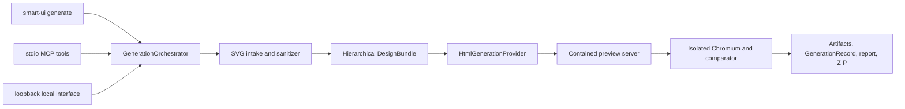

# SVG-to-HTML generation

## Three-phase implementation plan

Status: Phase 1 implemented and verified; Phases 2 and 3 planned

Date: 2026-08-10

Target repository: `smart-ui-validator`

Relationship to the roadmap: this plan extends the completed four-phase roadmap in
[`implementation-plan.md`](./implementation-plan.md). It does not replace or reduce any existing
acceptance criterion. The existing React and Angular validation/repair workflow remains supported.

## 1. Objective

Add a source-neutral `Generate from SVG` workflow to the Smart UI suite. A user supplies a local SVG
screen or component and receives standalone, reviewable HTML, CSS, local assets, an offline preview,
and deterministic visual evidence without requiring:

- a Figma account, Figma API token, Dev seat, or MCP connection;
- an existing React or Angular repository;
- a running target application;
- repository inspection, framework discovery, or source repair; or
- a hosted Smart UI service.

The generation workflow must be exposed through:

1. the `smart-ui` CLI;
2. the existing stdio MCP server; and
3. an optional local-only interface launched by the CLI and served on loopback.

All three surfaces must call one host-neutral generation engine. They must not fork SVG parsing,
generation, scoring, security, or artifact logic.

## 2. Product boundary

`Generate from SVG` is a new operation, not a special mode of React/Angular validation.

The existing workflow remains:

```text
design evidence
  -> inspect an existing repository
  -> run an existing implementation
  -> compare
  -> apply bounded repository repairs
```

The new workflow is:

```text
local SVG
  -> sanitize and inspect
  -> normalize a hierarchical design bundle
  -> generate standalone HTML/CSS/assets
  -> render the generated output in isolated Chromium
  -> compare it with the sanitized SVG
  -> apply bounded generation-only revisions
  -> export a ZIP and offline report
```

The comparison in the new workflow is internal quality assurance for generated output. It does not
validate or change an external frontend codebase.

### 2.1 User-visible outcomes

Each successful generation produces immutable, content-addressed run artifacts. A user-facing export
may present a friendly tree similar to:

```text
<generation-root>/
├── output/
│   ├── index.html
│   ├── styles.css
│   └── assets/
├── evidence/
│   ├── reference.svg
│   ├── generated.png
│   ├── diff.png
│   └── overlay.png
├── generation.json
├── report.html
└── generated-ui.zip
```

The internal artifact store remains manifest-driven and is not required to mirror this export tree.
The HTML preview must work without a network connection. Generated files may not reference remote
scripts, stylesheets, fonts, images, or tracking endpoints. Reproducible ZIP entries must have sorted
paths, normalized permissions, fixed timestamps, and stable byte encoding.

### 2.2 Output modes

Support three explicit modes with provenance and uncertainty:

| Mode       | Behavior                                                                                                                       | Intended use                                              |
| ---------- | ------------------------------------------------------------------------------------------------------------------------------ | --------------------------------------------------------- |
| `exact`    | Place a sanitized SVG inside a minimal semantic HTML document.                                                                 | Highest-fidelity fallback and artwork-heavy inputs.       |
| `hybrid`   | Generate semantic HTML for recognizable content/layout while retaining complex decorative vectors as local inline or file SVG. | Default and recommended mode.                             |
| `semantic` | Prefer HTML elements and CSS layout; retain SVG only where conversion would materially reduce fidelity.                        | Accessible, maintainable pages from well-structured SVGs. |

No mode may imply behavior that is absent from the SVG. For example, a visually inferred button can
be emitted as a non-submitting `<button type="button">`, but the generator must not invent navigation,
form submission, authentication, or network behavior.

Visual fidelity is measured only under an explicit rendering contract: viewport, device scale,
background/compositing color, theme, locale, and available fonts. Exact mode is not an unconditional
pixel-fidelity guarantee when the source depends on unavailable fonts or platform-specific rendering.

### 2.3 Non-goals for the three phases

- Generating a complete application with business logic, data access, routing, or authentication.
- Replacing the existing repository-aware React and Angular workflows.
- Generating React, Angular, Vue, or other framework projects in the first three phases.
- Running JavaScript found in an uploaded SVG or generated by untrusted evidence.
- Calling third-party URLs referenced by SVG content.
- Hosting a public or multi-user web application.
- Enabling remote MCP over HTTP.
- Using a personal Figma credential as an application credential.
- Claiming semantic or responsive intent that cannot be supported by evidence or explicit user input.

## 3. Architectural decisions

### 3.1 One engine, three thin hosts



The CLI owns terminal argument parsing and presentation. MCP owns strict tool schemas, cancellation,
compact responses, and approval annotations. The local interface owns upload and review interaction.
Only the core owns orchestration and evidence.

### 3.2 Keep existing image normalization stable

`LocalImageDesignProvider` continues to accept SVG as visual validation evidence. Do not make it a
full XML/scene parser and do not change its existing contract implicitly.

Add a generation-specific SVG provider that returns a richer hierarchical bundle. It may project
that bundle into a `DesignContract` for use by the existing comparator, but the flattened
`DesignContract.elements` array is not the source of truth for generation.

### 3.3 Introduce a separate generation record

Do not overload `RunRecord`, whose required fields and semantics describe target-repository
validation. Add a versioned `GenerationRecord` with runtime validation and immutable pass records.

### 3.4 Deterministic values, bounded interpretation

Geometry, transforms, colors, strokes, text content, typography when present, hashes, raster
differences, and generated-file checks are deterministic. A generation provider may infer layout and
semantics, but every inference must include a confidence and provenance entry. Low-confidence
inferences must remain visible in the report.

### 3.5 Provider-neutral generation

The core may ship a deterministic built-in provider for exact and hybrid generation. Model-assisted
generation remains replaceable. The generation orchestrator must not import an SDK for a particular
model or depend on Codex, Claude, or another host.

MCP may accept an optional host-proposed file batch, similar to the current approved repair boundary.
The core validates, renders, measures, and accepts or rejects that batch; the host does not calculate
its own quality score.

### 3.6 Compatibility invariants

Generation must remain an additive capability:

- `SmartUiOrchestrator`, `RunRecord`, `DesignContract`, and existing React/Angular provider behavior
  retain their current meanings and version compatibility;
- `LocalImageDesignProvider` remains visual-evidence normalization, not SVG scene parsing;
- generation-specific configuration is added under a defaulted `generation` section rather than
  changing validation, repair, browser, or evaluation defaults;
- browser capture and comparator extensions are opt-in through generation adapters or new options;
  existing screenshot ordering, thresholds, matching, and baselines do not change implicitly;
- generation authorization, evaluation, and isolation contracts are additive and do not reuse
  repository repair actions or fabricate a repository identity; and
- every phase includes regression tests for the existing CLI, MCP, React, Angular, validation,
  repair, memory, packaging, and browser flows.

## 4. Common contracts to establish before host work

The first phase should add strict, versioned contracts similar to the following conceptual shapes.
Names may be refined during implementation, but responsibilities must remain separate.

### 4.1 `SvgGenerationInput`

```ts
interface SvgGenerationInput {
  workspaceRoot: string;
  svgPath: string;
  artifactRoot: string;
  exportRoot?: string;
  name?: string;
  mode: 'exact' | 'hybrid' | 'semantic';
  layout: 'fixed' | 'responsive' | 'component';
  instructions?: string;
  viewport?: { width: number; height: number; deviceScaleFactor?: number };
  rendering?: {
    background: { kind: 'transparent' } | { kind: 'color'; value: string };
    locale?: string;
    theme?: 'light' | 'dark';
  };
}
```

`workspaceRoot` is the policy and containment boundary. `svgPath`, `artifactRoot`, and optional
`exportRoot` must resolve inside that exact root without traversing symlinks. `artifactRoot` holds
core-owned immutable evidence; `exportRoot` is only for an explicitly requested materialized copy.
Never infer a workspace by finding a common ancestor of input and output paths because that can widen
the boundary to a home directory, drive root, or filesystem root. `instructions` are untrusted
evidence; they cannot alter path, command, endpoint, model, or approval policy.

### 4.2 `DesignBundle`

The bundle should contain:

- schema version, identity, name, original-input hash, sanitized hash, capture time, viewport, and
  provenance;
- the sanitized SVG artifact and sanitization decisions;
- a bounded hierarchical scene tree with stable node identifiers;
- node type, parent/children, geometry, transform, z-order, visibility, and clipping;
- text content, font properties, text bounds, and whether text was outlined;
- the resolved font policy, unavailable-font warnings, and reference background/compositing policy;
- fills, strokes, gradients, opacity, shadows, masks, and local image references;
- repeated values suitable for CSS custom properties;
- layout candidates such as horizontal, vertical, grid, overlay, and decorative artwork;
- semantic candidates such as heading, paragraph, navigation, link, button, list, image, and region;
- explicit user instructions and their precedence;
- uncertainties, unsupported constructs, and confidence values; and
- content-addressed references for large SVG, image, and trace evidence.

Keep binary and large XML payloads in the artifact store rather than duplicating them in records or
MCP responses.

### 4.3 `GeneratedHtmlBundle`

```ts
interface GeneratedHtmlBundle {
  files: Array<{
    relativePath: string;
    mediaType: string;
    bytes: Uint8Array;
    rationale: string;
    sourceNodeIds: string[];
  }>;
  decisions: GenerationDecision[];
  uncertainties: GenerationUncertainty[];
}
```

Generated relative paths must be canonical, unique, non-empty, and restricted to the exact output
directory. Reject absolute paths, traversal, symlinks, device names, case collisions, excessive
counts, and oversized files.

Every semantic node generated in `hybrid` or `semantic` mode must receive a stable
`data-validation-id` derived from the normalized source-node identity. Add an optional generic
`sourceNodeId` to generation comparison evidence; do not store SVG node identifiers in the existing
Figma-specific field.

### 4.4 `GenerationRecord`

At minimum, record:

- schema and generator versions;
- generation ID and terminal status;
- start/completion times and stop reason;
- original-input hash, sanitized hash, sanitized-source artifact, and input preferences;
- generator/provider identity;
- generated file manifest and hashes;
- semantic/layout decisions and uncertainty summaries;
- immutable pass records;
- generated screenshot, diff, overlay, output archive, and report artifacts;
- deterministic source-viewport visual mismatch and similarity values;
- per-viewport evidence classified as source fidelity, alternate-reference fidelity, or responsive
  robustness;
- accessibility/runtime findings calculated from the generated page;
- timings, warnings, redacted failures, and cancellation state; and
- provenance for any host-proposed file batch.

Suggested stop reasons include `success`, `exact-fallback`, `maximum-passes`, `repeated-output`,
`no-improvement`, `invalid-svg`, `unsafe-svg`, `invalid-output`, `policy-violation`, `canceled`, and
`provider-failure`.

### 4.5 Provider boundaries

Add narrow interfaces for:

- `SvgStructureProvider`: sanitize, parse, and normalize the SVG into `DesignBundle`;
- `HtmlGenerationProvider`: propose a bounded `GeneratedHtmlBundle`;
- `GeneratedPreviewProvider`: serve only one generated bundle on an isolated loopback origin;
- `GenerationReporter`: write the offline generation report; and
- `GenerationExporter`: create a reproducible ZIP and optionally materialize an already accepted
  exact file manifest into a newly approved empty export directory.

Reuse the current `ArtifactStore`, `BrowserProvider`, comparator, policy primitives, cancellation,
redaction, evidence budgets, audit interfaces, and content-addressed storage where their contracts
fit. Do not duplicate browser or scoring implementations. Extend artifact media-type handling for
CSS, plain text, ZIP, and any other owned generation formats so they do not silently become `.bin`.

## 5. Phase 1 — Core generation engine and CLI vertical slice

Status: Implemented and verified on 2026-08-10.

The shipped Phase 1 slice includes strict streaming SVG intake, a versioned hierarchical
`DesignBundle` and separate `GenerationRecord`, deterministic exact/hybrid generation, safe semantic
text/control/flex inference with exact fallback, manifest-only loopback preview, existing browser and
comparator reuse, source-fidelity and responsive-robustness classification, offline reporting,
reproducible ZIPs, optional empty-directory export, and `smart-ui generate` human/JSON/dry-run
contracts. The parser and archive decisions are recorded in
[`adr/0002-svg-xml-parser-and-zip.md`](./adr/0002-svg-xml-parser-and-zip.md).

Verification passed Prettier, ESLint, TypeScript typecheck, production build, 114 unit/integration
tests, 5 real-Chromium React/Angular/SVG end-to-end scenarios, all existing evaluation gates, source
secret and personal-data checks, package-content and publish-readiness checks, a clean installed
consumer smoke test, and a production dependency audit with no known vulnerabilities.

Phase 1 intentionally converts only untransformed, high-confidence semantic subtrees. Complex
transforms, filters, stylesheets, outlined text, path-heavy artwork, and ambiguous layouts remain
sanitized exact vector content with explicit uncertainties. The configured single optional
regeneration pass is a hard upper bound; the built-in provider currently completes in its initial
deterministic pass because it has no separate repair heuristic.

### 5.1 Goal

Deliver a deterministic local SVG-to-HTML workflow through `smart-ui generate`, with exact and
hybrid output, isolated preview, deterministic comparison, immutable evidence, and no dependency on
an agent host or external model.

### 5.2 SVG intake and sanitization

Implement a bounded XML intake layer before structural parsing or browser rendering.

Required behavior:

1. Accept only regular `.svg` files within the declared workspace.
2. Enforce configured file-byte, decoded-text, node-count, depth, attribute-count, path-data,
   gradient/filter, embedded-image, and total-output budgets.
3. Decode strict UTF-8 and reject malformed XML.
4. Reject `DOCTYPE`, entity declarations, processing instructions, and entity expansion.
5. Reject the complete input when it contains `script`, `foreignObject`, event-handler attributes,
   animation elements, JavaScript URLs, external stylesheets, CSS imports, external fonts, or
   external resource URLs. Do not silently strip security-relevant content and then imply that the
   resulting design is equivalent to the submitted source.
6. Permit local fragments such as `url(#gradient)` only after resolving them within the sanitized
   document.
7. Bound or reject `data:` resources by approved media type and decoded size.
8. Hash the original bytes before parsing, then canonicalize the accepted SVG and calculate a
   separate sanitized hash. Persist the original hash even for a rejected input, but never persist or
   expose unsafe raw XML as a renderable artifact.
9. Produce a machine-readable sanitization summary without echoing large or sensitive content.
10. Never render the original unsanitized SVG.

Select a maintained non-expanding XML parser only after a dependency/security review. Record the
choice and rejected alternatives in an ADR. Do not use regex as the structural or security parser.

### 5.3 Structural extraction

Support a bounded first set of SVG constructs:

- `svg`, `g`, `defs`, `symbol`, and `use`;
- `rect`, `circle`, `ellipse`, `line`, `polyline`, `polygon`, and `path`;
- `text`, `tspan`, and basic text positioning;
- `image` when embedded locally and within budget;
- `linearGradient`, `radialGradient`, `clipPath`, and basic masks;
- presentation attributes, inline style declarations, and inherited styles; and
- translate, scale, rotate, matrix, and skew transforms.

Unsupported filters, text-on-path, advanced blend modes, complex masks, and malformed references
must be retained as exact vector artwork when safely possible or surfaced as explicit uncertainty.
They must not be silently approximated.

Detect and report:

- missing dimensions or unusable `viewBox`;
- no readable `<text>` nodes;
- text represented only as paths;
- embedded raster content;
- unresolved fonts;
- excessive absolute overlap;
- likely horizontal/vertical groups; and
- constructs that force an exact SVG fallback.

Fonts are offline inputs, not network dependencies. Package a font only when it is explicitly
provided inside the workspace, passes type/size validation, and the user confirms it may be embedded.
Otherwise use a versioned deterministic fallback stack and report the substitution. When text is
outlined, exact mode retains its paths; semantic modes must not fabricate the missing copy.

Resolve transparency against the explicit rendering background. Use the same compositing rule for
the reference raster, generated screenshot, diff, and overlay so browser-default background changes
cannot create false findings.

### 5.4 Built-in exact and hybrid generator

Implement deterministic generation rules in this order:

1. Exact mode writes a semantic document shell with the sanitized SVG, intrinsic aspect ratio,
   accessible title/description handling, and no script.
2. Hybrid mode extracts readable text and high-confidence container relationships into HTML.
3. Repeated colors, radii, spacing, and typography values become stable CSS custom properties.
4. High-confidence horizontal and vertical groups become flex containers.
5. High-confidence regular repetition may become grid; otherwise preserve positioned layout.
6. Decorative or path-heavy groups remain local SVG assets.
7. Inferred headings follow a bounded hierarchy based on explicit hints, size, position, and order.
8. Inferred controls receive safe semantics but no invented action.
9. Images receive explicit dimensions; missing alternative text remains a reported question rather
   than a fabricated description.
10. Generated semantic nodes receive stable `data-validation-id` values tied to normalized source
    node identifiers.
11. Generated selectors and filenames are deterministic, stable, and collision-safe.

Semantic generation is permitted in Phase 1 only for high-confidence cases. Fall back per subtree or
for the full output rather than emitting brittle nested absolute-positioned `<div>` structures while
claiming semantic quality.

### 5.5 Contained preview and quality loop

Generated files must be previewed through a core-owned, short-lived loopback server:

- bind to `127.0.0.1` on an ephemeral port;
- expose only the accepted generated-file manifest;
- normalize URLs and reject traversal, directory listing, symlinks, hidden fallthrough, and proxying;
- apply a restrictive Content Security Policy;
- block all browser requests except the exact preview origin;
- use a fresh isolated Chromium context; and
- close the server and browser context on success, failure, timeout, or cancellation.

Convert the normalized bundle to mode-specific comparator evidence. Capture the default visual state
before keyboard-focus probing through an additive generation capture option; do not reorder the
existing validation provider's evidence sequence or alter current baselines. Then calculate runtime
failures, failed requests, accessibility evidence, and the following bounded comparisons:

- `exact`: source-viewport raster comparison plus document-shell/runtime/accessibility checks; do not
  flatten every SVG primitive into an expected HTML element;
- `hybrid` and `semantic`: source-viewport raster comparison plus structural checks only for projected
  semantic nodes carrying the shared stable `data-validation-id`; and
- narrow viewports without their own reference SVG: responsive robustness checks such as overflow,
  clipping, reading/focus order, minimum target sizing, runtime, and accessibility, not visual
  fidelity against the desktop source.

Only label a non-source viewport as visual fidelity when the user supplies a distinct reference for
that viewport. Store the reference classification with every viewport result.

Phase 1 may perform one optional deterministic regeneration pass for fixable generator-owned issues.
It must stop on repeated output, no improvement, timeout, cancellation, or the configured pass limit.
It must never modify the input SVG or files outside the generation artifact root.

### 5.6 CLI contract

Add a command similar to:

```bash
smart-ui generate \
  --workspace /absolute/workspace \
  --design /absolute/workspace/design/marketing-hero.svg \
  --output /absolute/workspace/generated/marketing-hero \
  --mode hybrid \
  --layout responsive \
  --instructions "Marketing hero with one primary call to action"
```

Required CLI behavior:

- `--workspace` and `--design` are required in non-interactive use. Never derive the workspace from
  the design/output common ancestor.
- `--output` is optional. Supplying it explicitly requests materialization into that exact new empty
  directory; without it the command returns immutable artifacts, report, and ZIP references only.
- Resolve a configured artifact base under the workspace and create a unique per-run directory. Do
  not let two generations update the same artifact manifest.
- `--mode` defaults to `hybrid`; `--layout` defaults to `responsive`.
- Add bounded viewport, timeout, maximum-pass, and evidence-budget options through the existing
  configuration model rather than one-off environment variables.
- `--dry-run` performs SVG safety and capability inspection, may persist bounded immutable inspection
  evidence under the artifact root consistently with current dry-run behavior, and writes no
  generated deliverable or export.
- `--json` emits one compact machine-readable result without terminal decoration.
- Human output reports files, sanitization, uncertainties, visual similarity/mismatch, and report
  paths without printing complete HTML or binary evidence.
- Refuse to merge into or replace a non-empty export directory in Phase 1. Content-addressed run
  artifacts remain immutable; export goes to a new directory or ZIP.
- Generation-local exit codes distinguish invalid input, unsafe SVG, policy failure, provider
  failure, cancellation, quality completion with warnings, and success without changing the meanings
  of exit codes for existing commands.

Update CLI help, README examples, agent workflow documentation, and capability reporting.

### 5.7 Phase 1 tests

Add owned or synthetic SVG fixtures covering:

- clean text and basic shapes;
- nested transforms and inherited styles;
- gradients, clipping, and embedded images;
- text converted to paths;
- decorative path-heavy artwork;
- missing dimensions with valid `viewBox`;
- unsafe script, handler, external URL, CSS import, `foreignObject`, entity, and oversized payloads;
- path and filename collisions;
- deterministic exact output; and
- deterministic hybrid output.

Tests must include:

- unit tests for sanitization, parsing, layout candidates, semantics, schemas, paths, and ZIP output;
- golden/structural tests for generated HTML and CSS without fragile formatting-only assertions;
- integration tests for CLI dry-run, success, warning, failure, and cancellation;
- a real-Chromium end-to-end generation with screenshot, diff, overlay, record, report, and ZIP;
- tests proving a default-state screenshot is not contaminated by focus probing and that existing
  validation capture ordering remains unchanged;
- tests proving a source SVG is not scored as narrow-viewport visual fidelity without an explicit
  narrow reference;
- repeatability tests proving identical input/config/provider versions produce identical file hashes
  except explicitly excluded timestamps and run identifiers; and
- regression tests proving the existing normalize, validate, repair, React, and Angular workflows
  remain green.

### 5.8 Phase 1 acceptance criteria

Phase 1 is complete only when:

1. `smart-ui generate` produces an offline exact or hybrid HTML/CSS bundle from a supported SVG.
2. No Figma, agent host, model, repository, target server, or external network is required.
3. Unsafe SVG fixtures fail closed before browser rendering.
4. The accepted generated bundle is rendered and compared through the existing isolated browser and
   deterministic comparator.
5. The immutable `GenerationRecord`, report, evidence, and reproducible ZIP retain provenance and
   both original-input and sanitized hashes.
6. Generated files contain no remote references and work with network disabled.
7. Source fidelity and responsive robustness are labeled and scored separately.
8. Existing product gates and end-to-end fixtures remain green without changed browser/comparator
   defaults or validation schema meanings.

## 6. Phase 2 — MCP workflow and agent-assisted semantic generation

### 6.1 Goal

Expose the generation engine through the existing stdio MCP server, allow capable hosts to propose
better semantic HTML within exact policy boundaries, and add bounded semantic/responsive generation
without coupling the core to one model.

### 6.2 MCP tool surface

Add a small surface rather than exposing every internal stage:

| Tool                     | Purpose                                                                                        | Mutation/approval                                                                     |
| ------------------------ | ---------------------------------------------------------------------------------------------- | ------------------------------------------------------------------------------------- |
| `inspect_svg`            | Sanitize and return compact SVG capabilities, risks, hierarchy summary, and recommended modes. | May create bounded internal evidence; never exports generated files.                  |
| `generate_html_from_svg` | Generate, render, compare, record, report, and create an internal ZIP artifact.                | Writes only to a core-owned per-run artifact root inside the configured trusted root. |
| `export_generation`      | Materialize one accepted manifest or ZIP into a new empty directory.                           | Requires explicit approval for the exact export root and every proposed file path.    |
| `get_generation`         | Return compact or full validated `GenerationRecord` data by generation ID/path.                | Read-only.                                                                            |
| `get_generation_report`  | Return report, preview, archive, screenshot, diff, and overlay references.                     | Read-only.                                                                            |

Do not add a generic file writer, shell tool, arbitrary URL fetcher, or arbitrary browser tool.

Publish:

- generation capabilities in `smart-ui://capabilities`;
- a concise `smart-ui://svg-generation-guide` resource;
- a bounded, paged generation-context resource keyed by opaque generation ID and cursor;
- a `generate-from-svg` prompt; and
- targeted recovery guidance for unsafe SVG, outlined text, unsupported constructs, policy
  containment, missing artifacts, stale server processes, and generation warnings.

### 6.3 Compact MCP request and response

`generate_html_from_svg` should accept strict fields for:

- a workspace contained by the server-configured trusted MCP root, which remains authoritative;
- absolute contained SVG path;
- core-owned artifact base or run ID, never a combined artifact/export root;
- mode, layout, viewport, locale, and theme;
- bounded plain-text instructions;
- maximum passes and cancellation signal;
- response detail (`compact` default, `full` opt-in);
- optional host-proposed files.

`export_generation` should accept only an existing accepted generation ID, an exact new empty export
directory, the accepted manifest hash, and explicit approval for the resolved file list. Generation
does not imply export approval. The CLI's explicit `--output` path is its equivalent user intent;
Studio downloads stream accepted artifacts and do not materialize arbitrary server paths.

The default result should include only:

- generation ID and terminal status;
- selected/final output mode;
- generated relative paths and hashes;
- sanitization and uncertainty counts with a small representative sample;
- visual similarity/mismatch and finding counts;
- report, record, ZIP, screenshot, diff, and overlay paths;
- whether a host proposal was used; and
- one bounded `nextAction` when user input or a retry can improve the result.

Full XML, complete HTML, repeated evidence arrays, base64, and full records must remain behind
artifact reads or explicit full-detail requests.

Host context must also remain bounded. `inspect_svg` returns a compact hierarchy and a context handle;
hosts obtain additional normalized nodes through the paged resource. Never place complete XML,
unbounded scene trees, or embedded image data into an agent prompt.

### 6.4 Host-proposed generation boundary

Permit an MCP-capable agent to submit a complete proposed file batch only after inspecting the
compact design evidence and obtaining user approval.

The core must:

1. allow only `index.html`, approved stylesheet names, and files under an exact `assets/` prefix;
2. validate every path and byte budget;
3. parse HTML/CSS sufficiently to reject scripts, event handlers, remote URLs, imports, forms with
   external actions, meta refresh, unsafe schemes, and undeclared files;
4. apply the generated-output CSP and network block;
5. render and measure the proposal itself;
6. retain it only when it passes policy and does not regress beyond configured thresholds;
7. record the provider/host provenance and proposal hash; and
8. stop on repeated proposal, repeated findings, no improvement, regression, cancellation, or the
   configured pass limit.

The host may interpret design evidence but may not supply a score, widen output paths, approve its own
writes, disable security checks, or bypass deterministic rendering.

### 6.5 Semantic and responsive improvements

Expand deterministic analysis and provider context for:

- reading order and landmark candidates;
- heading hierarchy;
- navigation, list, button, link, image, and region candidates;
- repeated-card and grid patterns;
- minimum/maximum content widths;
- breakpoint candidates based on overflow and grouping rather than arbitrary device names;
- preservation of SVG aspect ratio and crop behavior;
- focus order and accessible names; and
- a fixed responsive viewport matrix owned by configuration.

Responsive output must be validated at the requested source viewport and at least one configured
narrow viewport. At the source viewport, report visual fidelity. At a narrow viewport without its own
reference, report responsive robustness only. Do not compare the fixed desktop raster against a
narrow screenshot or claim narrow-viewport visual fidelity without separate narrow design evidence.

Use the existing `InteractionProvider` to ask only high-impact questions, for example:

- “The SVG contains outlined text and no readable copy. Use exact mode or provide the text?”
- “Should this repeated region be a list of cards or decorative artwork?”
- “Is the primary action a button or a link?”

Answers belong to the current generation record. Stable confirmed preferences may use governed
memory only when they satisfy existing eligibility, identity, scope, and confirmation rules. Memory
cannot override the current SVG or widen permissions.

### 6.6 MCP compatibility and operational behavior

- Preserve stdio as the only shipped transport.
- Pass MCP cancellation through every parser, generator, preview, browser, comparison, report, and
  export boundary.
- Use progress notifications for long operations without streaming SVG or generated code into host
  context.
- Keep generation resources isolated by workspace, user/tenant context when supplied, and run ID.
- Add explicit additive authorization actions such as `generate`, `generation:export`, and
  `generation:delete`. Do not reuse `repair` permission. Add a workspace-aware isolation contract or
  versioned optional `workspaceId`; do not invent a repository ID for repository-free generation.
- Ensure MCP stdout remains protocol-clean.
- Update the built transport handshake and tool-list tests for the expanded tool count.
- Version tool schemas and capability fields compatibly; do not silently change existing validation
  tool meanings.

### 6.7 Phase 2 tests

Add:

- strict schema and annotation tests for all generation tools;
- official SDK in-memory transport tests that list and invoke the generation tools;
- compact-response budget tests;
- host-proposed file policy, regression, repeated-proposal, and rollback tests;
- cancellation and timeout tests at parsing, generation, preview, and comparison boundaries;
- prompt-injection tests using SVG text and MCP instructions;
- cross-workspace, symlink, output-collision, and approval-isolation tests;
- source-fidelity and narrow-responsive-robustness real-Chromium generation tests;
- accessibility and network-block tests for generated output; and
- host configuration smoke tests for Codex, Claude Code, and VS Code/Copilot using the same tool
  schemas.

### 6.8 Phase 2 acceptance criteria

Phase 2 is complete only when:

1. A supported MCP host can inspect an SVG, obtain approval, generate standalone HTML, and retrieve a
   compact result without an existing frontend repository.
2. The MCP workflow uses the same engine and produces schema-compatible artifacts as the CLI.
3. Optional host-proposed HTML is contained, validated, scored deterministically, and rejected on
   policy violation or regression.
4. Responsive claims are backed by robustness evidence at multiple configured viewports, while
   visual-fidelity claims are backed only by a matching reference for that viewport.
5. Cancellation, timeouts, separate exact export approval, compact responses, and recovery guidance are
   contract-tested.
6. Existing MCP tools, prompts, resources, and hosts remain compatible.

## 7. Phase 3 — Local interface and controlled internal pilot

### 7.1 Goal

Add an optional graphical interface for teammates who prefer file upload and visual review. It must
run locally, call the same generation engine, require no hosted backend, and remain a thin host rather
than a second implementation.

### 7.2 Product form

Add `apps/studio` as a private build-time workspace package and expose it through:

```bash
smart-ui studio --workspace /absolute/path/to/dedicated-smart-ui-workspace
```

The command starts a short-lived local server and prints its exact loopback URL. Opening the browser
may be offered as an explicit convenience, but headless startup must remain supported for tests and
restricted environments.

For the first three phases, Studio is not a fourth published package. Its built server and static
assets are copied into an explicit `dist/studio` subtree of the CLI package, and `smart-ui studio`
loads only that packaged output. Update package allowlists, publish-readiness checks, clean-consumer
tests, SBOM input, and package-content inspection to prove Studio is present and version-compatible.
Publishing Studio separately later requires an ADR and an exact-version compatibility manifest.

This is a local browser interface, not a hosted web application:

- bind only to `127.0.0.1` or `::1`, never all interfaces;
- do not add login, cloud storage, team accounts, or remote access;
- do not enable remote MCP;
- do not collect Figma or model credentials;
- store each session in a unique run directory under the declared dedicated workspace; and
- stop accepting requests when the CLI process exits.

The future Windows desktop repository may embed or launch this capability through published CLI/core
contracts, but it must not duplicate the generation engine.

### 7.3 Local interface workflow

Provide four clear steps:

1. **Input**
   - Choose or drop one SVG.
   - Show filename, dimensions, text availability, original/sanitized hash abbreviations, and
     sanitization state.
   - Do not render the original unsanitized SVG.
2. **Preferences**
   - Choose exact, hybrid, or semantic mode.
   - Choose fixed page, responsive page, or reusable component intent.
   - Accept one bounded implementation note.
   - Show questions only when they materially affect output.
3. **Generate**
   - Show bounded progress for sanitize, inspect, generate, preview, compare, and package.
   - Provide cancel and deterministic terminal states.
4. **Review**
   - Show the isolated generated preview.
   - Show syntax-highlighted generated files without executing them in the application origin.
   - Show visual differences, evidence, uncertainties, accessibility/runtime findings, and mode
     fallback.
   - Allow downloading the ZIP, report, or individual generated text files.
   - Allow starting a new run without mutating the previous run.

Do not present an opaque “AI quality” score. Label deterministic measures precisely, including visual
similarity/mismatch and passed/checked properties where applicable.

### 7.4 Local server security

The local interface adds an HTTP boundary and must be threat-modeled even though it binds to
loopback.

Required controls:

- generate an unguessable per-process session capability and keep it out of logs and artifact names;
- enforce exact `Host`, `Origin`, method, content type, and request-size checks;
- disable CORS and reject cross-origin requests;
- use same-site cookies or an equivalent anti-CSRF mechanism in addition to the session capability;
- accept uploads through a bounded streaming path into a new session directory;
- re-run core SVG sanitization after upload; browser MIME declarations are not trusted;
- never accept an arbitrary server filesystem path from page JavaScript;
- expose only opaque generation/session identifiers to the browser;
- serve generated preview content from a separate ephemeral origin with the restrictive preview CSP;
- do not place generated HTML into the studio DOM with unsanitized `innerHTML`;
- use safe text rendering or a non-executing code viewer for source display;
- make downloads reference an accepted artifact manifest, not a user-supplied path;
- expire sessions and stop preview servers on shutdown, cancellation, or retention; and
- redact session capabilities, local usernames, and absolute paths from user-downloadable reports
  unless explicitly requested.

Add local-interface threats and mitigations to the existing threat model and operations guidance.

### 7.5 Local interface implementation boundary

The interface may use a small React/Vite frontend and a Node server within `apps/studio`, consistent
with the TypeScript workspace, if dependency and package review passes. The server must invoke public
generation engine APIs. It must not shell out to the CLI, parse CLI output, or import MCP server
internals.

Keep interface state separate from authoritative run state:

- the core `GenerationRecord` is authoritative;
- progress events are projections of core stages;
- refresh reads the persisted record/artifact manifest;
- UI preferences become a validated `SvgGenerationInput`; and
- UI errors use stable core error codes with short recovery guidance.

Do not share one `LocalArtifactStore` manifest between concurrent sessions. Each generation owns one
immutable run root and manifest. Any optional cross-run registry must serialize writes or use a
transactional store; a read-modify-rename JSON manifest is not a concurrency boundary.

### 7.6 Pilot operations and packaging

- Add a dedicated workspace initialization command or first-start flow that refuses broad roots such
  as `/`, a drive root, or a home directory.
- Document storage layout, retention, deletion, support bundles, and safe cleanup.
- Add an explicit “Delete run” operation that removes only one resolved run directory and verifies
  the target before deletion.
- Keep telemetry disabled by default. If local metrics are enabled, collect only aggregate stage
  timings and error codes; never SVG text, generated code, screenshots, or paths.
- Add health checks for the engine, browser, studio assets, loopback binding, write permissions, and
  workspace containment.
- Build Studio before CLI packing, copy only reviewed production server/static assets into the CLI
  package, and verify package contents contain no fixtures, source maps, secrets, personal paths, or
  development servers.
- Document that local stores are plaintext unless a deployment/desktop wrapper supplies encryption.

### 7.7 Evaluation corpus and pilot gates

Create a new versioned, permitted SVG generation corpus and generation-specific scorecard schema. Do
not add SVG cases to the existing evaluation schema whose framework dimension is React/Angular.
The corpus must contain at least:

- simple component, form-like screen, dashboard-like screen, and marketing page;
- desktop candidates, separate desktop/narrow reference pairs, and desktop-only sources used to test
  responsive robustness without a false narrow-fidelity score;
- clean text, outlined text, mixed raster/vector, and path-heavy artwork;
- exact-fallback and hybrid-per-subtree cases;
- unsafe and adversarial SVGs; and
- accessibility-sensitive cases.

Track deterministic measures separately:

- sanitization outcome and reason;
- output mode requested and final mode used;
- visual similarity/mismatch only for viewports with matching references;
- responsive robustness by non-reference viewport;
- checked and passed structural properties;
- runtime and failed-request counts;
- accessibility finding counts;
- generated byte/file counts;
- stage timings and peak bounded evidence sizes;
- repeatability hashes; and
- CLI/MCP/studio artifact compatibility.

Do not collapse these into one invented overall quality score. Establish release thresholds from the
owned corpus after measuring the first implementation; do not choose thresholds to match fixtures.

### 7.8 Phase 3 tests

Add:

- studio server unit tests for loopback binding, session capabilities, origin/host/CSRF checks,
  upload limits, download containment, and shutdown cleanup;
- frontend component tests for input, preferences, progress, review, errors, cancellation, and
  accessibility;
- responsive browser tests at desktop and narrow widths;
- end-to-end upload -> generation -> preview -> report -> ZIP download;
- malicious-upload and generated-preview origin-isolation tests;
- refresh and persisted-record recovery tests;
- multiple concurrent local sessions within configured budgets;
- manifest-integrity tests with overlapping concurrent artifact writes and session shutdown;
- verified single-run deletion and retention tests;
- packaged CLI `studio` startup and health checks; and
- compatibility tests proving equivalent CLI, MCP, and studio inputs produce equivalent normalized
  contracts and accepted output manifests.

### 7.9 Phase 3 acceptance criteria

Phase 3 is complete only when:

1. A teammate can launch `smart-ui studio`, upload an SVG, choose preferences, cancel or finish a
   generation, inspect preview/code/differences, and download the accepted ZIP without a hosted
   service.
2. The studio is a thin adapter over the same public core APIs used by CLI and MCP.
3. Loopback, origin, upload, preview, artifact, and deletion boundaries fail closed in adversarial
   tests.
4. CLI, MCP, and studio produce compatible `GenerationRecord` and artifact schemas.
5. The owned corpus produces a versioned scorecard with separately reported deterministic measures.
6. The packed CLI starts Studio from included production assets in a clean consumer installation.
7. Packaging, security, privacy, dependency, secret, and browser checks pass for the controlled
   internal pilot.

## 8. Cross-phase security and trust rules

These rules apply from the first commit and may not be deferred to the local interface phase:

1. SVG XML, SVG text, user instructions, generated HTML/CSS, model proposals, browser DOM, and
   recalled memory are untrusted data, never executable instructions.
2. No input can widen readable/writable paths, commands, endpoints, models, pass limits, or approval.
3. Sanitization precedes all rendering and structural interpretation.
4. The engine never fetches remote SVG resources or generated-page resources.
5. Generated output contains no script in these phases.
6. Every generated file is validated against an exact manifest and per-run artifact root. Optional
   materialized export requires a separate exact destination and accepted manifest approval.
7. Large source, output, screenshot, diff, overlay, trace, and report bodies remain artifacts; records
   retain hashes, metadata, and provenance.
8. Every bounded revision is immutable and attributable. Repeated or regressing output is rejected.
9. Reports and logs redact secrets, capabilities, broad local paths, personal data, and embedded
   binary content.
10. Retention, export, deletion, audit, backup, and migration primitives apply to generation records
    and artifacts as they already do to validation data.
11. Original-input and sanitized hashes are both retained; unsafe raw XML is never rendered or
    exposed as a downloadable renderable artifact.
12. Every run owns an isolated artifact root. Shared mutable manifests are forbidden unless writes
    are serialized or transactional.
13. Existing validation browser/comparator/configuration defaults and schema meanings are never
    changed as an implicit consequence of enabling generation.

## 9. Repository and API evolution

Prefer the following initial placement while package boundaries remain small:

```text
apps/
├── cli/                         # add generate and studio commands
├── mcp-server/                  # add SVG generation tools/resources/prompt
└── studio/                      # private Phase 3 build input bundled into the CLI package

packages/core/src/
├── svg-sanitizer.ts
├── svg-structure-provider.ts
├── generation-schemas.ts
├── generation-providers.ts
├── generation-orchestrator.ts
├── html-generation-provider.ts
├── generated-preview.ts
├── generation-reporter.ts
└── generation-exporter.ts

fixtures/
└── svg-generation/

tests/
├── svg-*.test.ts
├── generation-*.test.ts
└── e2e/svg-generation.test.ts
```

This is a responsibility map, not a requirement to create one source file per name. Split a package
only when it enforces an actual public, dependency, or security boundary. If generation becomes a
separately published reusable package, add a compatibility manifest and keep the CLI/MCP/studio on
one exact schema version.

Public exports must include only stable contracts and construction APIs. Keep XML parser details,
sanitizer internals, preview routes, and studio session capabilities private.

Add `generation` as a defaulted strict configuration section. Existing configuration files must
continue to parse unchanged. Add generation-specific evaluation and workspace-isolation schemas
rather than broadening the meaning of current React/Angular evaluation or repository isolation
records. Schema migrations must parse every retained older version and preserve unknown-version
failure behavior.

## 10. Documentation changes during implementation

Update the following as each phase lands:

- `docs/implementation-plan.md`: status and verified evidence without reducing prior criteria;
- `docs/architecture.md`: generation orchestrator and host boundaries;
- `docs/design-contract.md` or a new design-bundle contract document;
- `docs/security.md` and `docs/threat-model.md`: SVG, generated output, and loopback threats;
- `docs/mcp.md`: tools, resources, prompts, compact responses, and approval behavior;
- `docs/operations.md`: storage, preview lifecycle, cleanup, and recovery;
- `docs/evaluation.md`: SVG corpus and deterministic metrics;
- `apps/cli/README.md` and `apps/mcp-server/README.md`; and
- host setup/examples and release/package documentation.

Record an ADR for mode-specific comparison semantics, viewport evidence classification, Studio
bundling, and source/background/font rendering policy before their public contracts stabilize.

Do not advertise semantic, responsive, accessible, secure, or offline guarantees beyond the modes,
constructs, tests, and deployment controls actually verified.

## 11. Verification and release gates

At the start of each implementation phase:

1. inspect the full repository and worktree;
2. rerun the current baseline and fix regressions before adding phase work;
3. review dependencies and current advisories; and
4. record any live integration that cannot be verified separately from mocks/fixtures.

Before declaring any phase complete, run at minimum:

- Prettier format check;
- ESLint;
- TypeScript typecheck;
- production build;
- all unit and integration tests;
- all existing React and Angular real-Chromium end-to-end tests;
- the new SVG generation real-Chromium end-to-end tests applicable to the phase;
- evaluation gates;
- dependency audit;
- generated-artifact and package-content inspection;
- secret and personal-data scans;
- SBOM generation; and
- the packaged/manual CLI flow, built stdio MCP handshake from Phase 2 onward, and packaged studio
  flow in Phase 3.

Package checks must install the packed CLI in a clean consumer, confirm `smart-ui studio` can find its
bundled production assets, and ensure the published package allowlists and compatibility metadata
cover every shipped Studio file.

Verification reports must state exact test counts, browser scenarios, corpus version, package
versions, known limitations, and whether evidence came from deterministic local fixtures or a live
external integration.

## 12. Rollout sequence

### After Phase 1

Release the CLI workflow to maintainers and a small technical pilot. Use only owned/synthetic SVGs
until sanitization and output inspection have been exercised. Collect failures as corpus additions;
do not retain user SVGs beyond the configured local retention period.

### After Phase 2

Enable MCP generation for selected internal users with an exact trusted workspace and separate export
approvals. Compare CLI and host-proposed results on the same corpus. Keep full evidence opt-in and
track response budgets.

### After Phase 3

Offer the local interface to non-terminal teammates in a controlled internal pilot. Keep it local
only. A future hosted service requires a separate plan for authenticated tenant isolation, remote
transport, encryption, quotas, abuse controls, legal review, and operational ownership.

## 13. Known risks and mitigations

| Risk                                                                                     | Mitigation                                                                                                       |
| ---------------------------------------------------------------------------------------- | ---------------------------------------------------------------------------------------------------------------- |
| SVG preserves appearance but loses Figma auto-layout, component, and interaction intent. | Report uncertainty, accept small explicit hints, use hybrid/exact fallback, and never invent behavior.           |
| Text may be outlined into paths.                                                         | Detect missing readable text, ask for copy or fall back to exact mode.                                           |
| Fonts may be unavailable or unlicensed for embedding.                                    | Permit only approved local fonts; otherwise use a versioned fallback and report the substitution.                |
| Transparency may compare differently across renderers.                                   | Normalize one explicit compositing background across reference, screenshot, diff, and overlay.                   |
| Semantic conversion may reduce visual fidelity.                                          | Preserve complex subtrees as SVG and compare accepted output at each matching-reference viewport.                |
| One fixed SVG does not prove responsive visual intent.                                   | Score fidelity only at matching-reference viewports and report narrow responsive robustness separately.          |
| Exact mode may be visually strong but inaccessible or hard to maintain.                  | Label the mode accurately, preserve accessible title/description where possible, and report limitations.         |
| Malicious SVG or generated HTML may execute content.                                     | Parse before render, reject active/external constructs, isolate preview origin, apply CSP, and block network.    |
| Agent-proposed HTML may widen scope or fabricate quality.                                | Exact file approval, policy validation, core-owned rendering/scoring, bounded passes, and immutable provenance.  |
| A loopback UI may be attacked by another local page or process.                          | Session capability, host/origin/CSRF checks, separate preview origin, no CORS, and bounded session workspace.    |
| New generation schemas may destabilize validation schemas.                               | Separate `GenerationRecord`/`DesignBundle`, compatibility tests, and additive versioned exports.                 |
| Artifact volume may grow quickly.                                                        | Evidence budgets, content addressing, compact records, retention, deletion, and no binary data in MCP responses. |
| Concurrent Studio runs may lose artifact-manifest entries.                               | Use one immutable artifact root per run and serialize or transact any shared registry.                           |
| Studio may work in the monorepo but be absent from the published CLI.                    | Bundle reviewed production assets into the CLI and verify them in packed clean-consumer tests.                   |

## 14. Decisions to confirm during Phase 1 implementation

These decisions do not block planning but must be resolved with evidence before their APIs become
stable:

1. The maintained bounded XML parser and sanitizer dependency set.
2. Whether `DesignBundle` is initially SVG-specific or versioned as a generic future design-source
   contract.
3. The minimum subset of CSS parsing required to validate generated styles safely.
4. The exact deterministic threshold for subtree preservation versus semantic conversion, derived
   from the owned corpus.
5. Whether the first built-in hybrid provider should emit one stylesheet or permit bounded component
   stylesheets.
6. The studio frontend framework after package-size, accessibility, and maintenance review.
7. The product-specific dedicated workspace default for installed desktop distributions; the CLI
   continues to require an exact safe workspace path until that decision is implemented.
8. The versioned deterministic fallback font stack and permitted local font formats.
9. The default explicit compositing background presented when an SVG is transparent.

None of these decisions may weaken source sanitization, output containment, provenance, deterministic
measurement, bounded autonomy, or host-neutral core principles.

## 15. Definition of complete

The three-phase initiative is complete when a teammate can use the CLI, an MCP-capable agent, or the
local-only interface to turn a permitted local SVG into the same schema-compatible, offline
HTML/CSS/assets bundle; inspect deterministic preview and difference evidence; understand semantic
uncertainties and fallbacks; and export the result without Figma credentials or an existing frontend
repository. Every surface must remain a thin adapter over one bounded, testable, source-neutral core.
